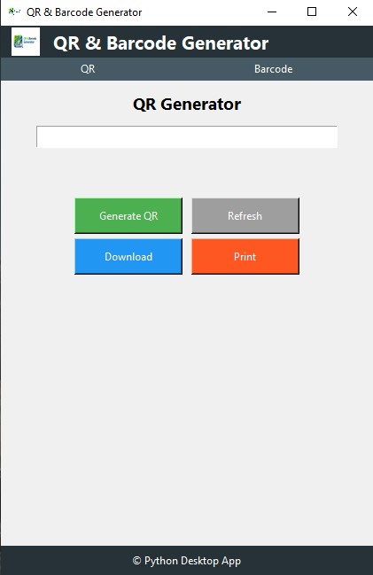
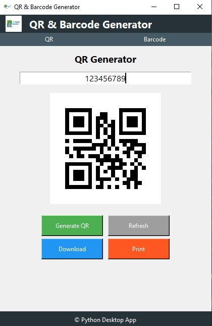
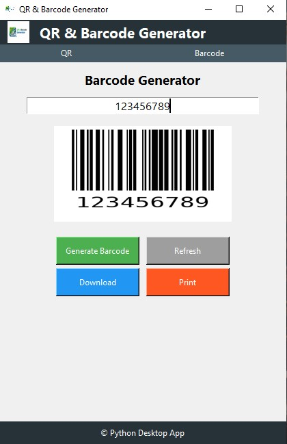

# QR & Barcode Generator Desktop App

A Python-based desktop application that generates QR codes and barcodes offline with a simple GUI interface.

## Features
- Generate QR Codes instantly
- Create Barcodes
- Offline desktop software
- Save generated images
- Lightweight & user-friendly

## Tech Stack
- Python
- Tkinter
- Pillow (PIL)
- QRCode Library
- PyInstaller

## Installation
git clone https://github.com/YOUR_USERNAME/qr-barcode-generator.git

cd qr-barcode-generator
pip install -r requirements.txt
python main.py

## Screenshots

### Main Window

### QR Generator

### Barcode Generator

### Generated Output
)

## Author
Saurabh Kanaujiya
Connect with me on LinkedIn: 
https://www.linkedin.com/in/saurabh-kanaujiya-python/
